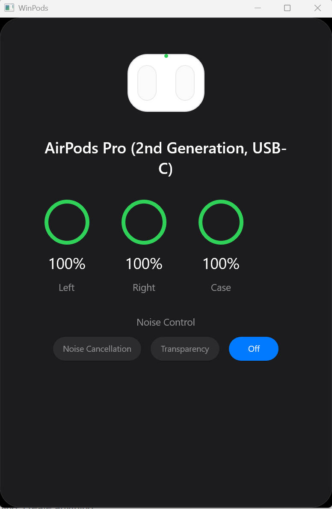

# WinPods - AirPods Experience for Windows

> **Version 1.0.0** - Bring the native AirPods experience to Windows with beautiful UI and seamless functionality.



## ✨ Features

### ✅ Working in v1.0

- **🎧 Battery Monitoring** - Real-time battery levels for left/right AirPods and case in system tray tooltip
- **📦 iOS-Style Popup** - Beautiful popup appears when you open your AirPods case near your PC
- **🎵 Media Controls** - Play/Pause your media from the system tray menu (Ctrl+Alt+P hotkey)
- **🔔 Low Battery Alerts** - Toast notifications when AirPods battery drops below 20%
- **⚙️ Settings UI** - Modern WinUI 3 settings window for customization
- **🖥️ System Tray Integration** - Runs in background with native Windows system tray icon
- **🔍 Bluetooth LE Scanning** - Automatically detects and connects to your AirPods

### ⚠️ Known Windows Limitations

The following features are **NOT possible** on Windows without kernel-level drivers:

- **Noise Control** (ANC/Transparency/Off) - Requires kernel-level Bluetooth access
- **Auto-Pause on Ear Removal** - Real-time ear detection needs L2CAP access (blocked by Windows)

**Why?** When AirPods are connected as an audio device, Windows locks the Bluetooth connection and prevents GATT/L2CAP access from user-space applications. This is a fundamental Windows Bluetooth stack limitation.

**Alternatives:**
- Use your iPhone to change noise control modes
- Consider [MagicPods](https://github.com/spike01/MagicPods-Windows) (requires installing a kernel driver)
- Use the physical button on your AirPods Pro to cycle through modes

## 🚀 Installation

### Prerequisites

- Windows 10 version 1809 or later (Windows 11 recommended)
- [.NET Desktop Runtime 10.0](https://dotnet.microsoft.com/download/dotnet/10.0) (or later)

### Quick Start

1. Download the latest release from the [Releases](../../releases) page
2. Extract the ZIP file
3. Run `WinPods.App.exe`
4. Open your AirPods case near your PC
5. The battery popup will appear automatically!

### Building from Source

```bash
# Clone the repository
git clone https://github.com/changcheng967/WinPods.git
cd WinPods

# Restore dependencies
dotnet restore

# Build Release configuration
dotnet build -c Release

# Run
src\WinPods.App\bin\Release\net10.0-windows10.0.26100.0\WinPods.App.exe
```

## 🎮 Usage

### System Tray Menu

Right-click the WinPods icon in the system tray to access:

- **Play/Pause Media** - Control your music playback
- **Noise Control** - Shows explanation of Windows limitation
- **Show Popup** - Manually display the battery popup
- **Settings** - Open the settings window
- **Exit** - Close the application

### Global Hotkeys

- **Ctrl+Alt+P** - Play/Pause media
- **Ctrl+Alt+N** - Show noise control popup (informational only)

### Settings

Access the settings window from the system tray menu to configure options.

## 🛠️ Technology Stack

- **C# / .NET 10** - Modern Windows development
- **WinUI 3** - Native Windows 11 UI framework
- **Windows App SDK** - Latest Windows APIs
- **Bluetooth LE** - Native Windows.Devices.Bluetooth.LE API
- **Media Control** - Windows GlobalSystemMediaTransportControlsSessionManager

## 📊 Supported AirPods

- ✅ AirPods (1st, 2nd, 3rd Generation)
- ✅ AirPods Pro (1st, 2nd Generation, USB-C)
- ✅ AirPods Max
- ✅ Beats Studio Buds, Beats Fit Pro, and other Apple headphones

## 🐛 Troubleshooting

### AirPods not detected?

1. Make sure Bluetooth is enabled on your PC
2. Open your AirPods case near your PC
3. Ensure AirPods are not currently connected to another device (iPhone, iPad, etc.)
4. Try restarting WinPods

### Battery levels not updating?

1. Check that your AirPods are connected via Bluetooth
2. Open the case lid to trigger a new BLE advertisement
3. Move closer to your PC

### Play/Pause not working?

1. Make sure a media app is playing music/video (Spotify, YouTube, etc.)
2. The Play/Pause function controls the currently active media session

## 🔬 Development

### Project Structure

```
WinPods/
├── src/
│   ├── WinPods.Core/           # Core library (BLE parsing, models)
│   └── WinPods.App/            # WinUI 3 application
├── docs/                       # Documentation and screenshots
└── README.md
```

### Contributing

We welcome contributions! Please see [CONTRIBUTING.md](CONTRIBUTING.md) for guidelines.

## 📝 License

This project is licensed under the MIT License - see the [LICENSE](LICENSE) file for details.

## 🙏 Acknowledgments

- **[AirPodsDesktop](https://github.com/SpriteOvO/AirPodsDesktop)** - Inspiration and protocol research
- **[MagicPods-Windows](https://github.com/steam3d/MagicPods-Windows)** - Advanced Windows implementation
- **[librepods](https://github.com/kavishdevar/librepods)** - Protocol documentation and reverse engineering

## 📄 Privacy Policy

WinPods:
- Does not collect or transmit any data
- Runs entirely locally on your Windows PC
- Only communicates with your AirPods via Bluetooth
- Does not require an internet connection

## 🔗 Links

- [GitHub Repository](https://github.com/changcheng967/WinPods)
- [Issue Tracker](https://github.com/changcheng967/WinPods/issues)
- [Releases](https://github.com/changcheng967/WinPods/releases)

---

**Made with ❤️ for the Windows community**
