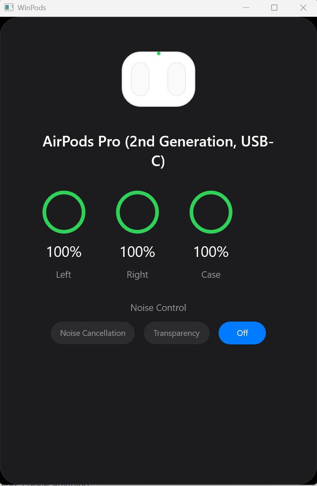

# WinPods - AirPods Experience for Windows

> **Version 1.2.0** - Bring the native AirPods experience to Windows with iOS 26 Liquid Glass UI and seamless functionality.



## Features

### Working in v1.2.0

- **Battery Monitoring** - Real-time battery levels for left/right AirPods and case in system tray tooltip
- **iOS 26 Liquid Glass Popup** - Beautiful translucent popup with blur effect appears when you open your AirPods case
- **Auto-Connect** - Automatically connects AirPods audio when you open the case near your PC
- **Media Controls** - Play/Pause your media from the system tray menu (Ctrl+Alt+P hotkey)
- **Low Battery Alerts** - Toast notifications when AirPods battery drops below 20%
- **Settings UI** - Modern WinUI 3 settings window for customization
- **System Tray Integration** - Runs in background with native Windows system tray icon
- **Bluetooth LE Scanning** - Automatically detects and connects to your AirPods
- **Global Hotkeys** - Ctrl+Alt+P (Play/Pause), Ctrl+Alt+N (Next Track)

### In Progress: Noise Control

Noise control (ANC/Transparency/Off/Adaptive) requires kernel-level Bluetooth access. This release includes:

- **AAP Protocol Layer** - Complete implementation of Apple Accessory Protocol in `src/WinPods.Core/AAP/`
- **KMDF Driver Source** - L2CAP bridge driver in `driver/WinPodsAAP/`

The driver must be compiled with Visual Studio + WDK and installed manually. It has not yet been verified on real hardware.

## Installation

### Prerequisites

- Windows 10 version 1809 or later (Windows 11 recommended)
- [.NET Desktop Runtime 10.0](https://dotnet.microsoft.com/download/dotnet/10.0) (or later)

### Quick Start

1. Download the latest release from the [Releases](../../releases) page
2. Extract the ZIP file
3. Run `WinPods.App.exe`
4. Open your AirPods case near your PC
5. The battery popup will appear automatically!

### Building from Source

```bash
# Clone the repository
git clone https://github.com/changcheng967/WinPods.git
cd WinPods

# Restore dependencies
dotnet restore

# Build Release configuration
dotnet build -c Release

# Run tests
dotnet test -c Release

# Run
src\WinPods.App\bin\Release\net10.0-windows10.0.26100.0\WinPods.App.exe
```

## Building & Testing the Driver

The noise control driver is included as source code only. To build and test:

### Prerequisites

1. **Visual Studio 2022 or later** with:
   - "Desktop development with C++" workload
   - "Windows Driver Kit (WDK)" extension

2. **Windows Driver Kit (WDK)** - Download from Microsoft

### Build Steps

1. Open `driver/WinPodsAAP/WinPodsAAP.vcxproj` in Visual Studio
2. Select **Release** configuration and **x64** platform
3. Build the solution (Ctrl+Shift+B)
4. Output will be in `driver/WinPodsAAP/x64/Release/`

### Install for Testing

**Important**: This requires enabling test signing mode.

```powershell
# Enable test signing (requires admin)
bcdedit /set testsigning on

# Restart Windows

# Install the driver
pnputil /add-driver WinPodsAAP.inf /install

# Run WinPods app
# The noise control buttons should become enabled when AirPods are connected
```

### After Testing

```powershell
# Disable test signing
bcdedit /set testsigning off

# Restart Windows
```

### Production Use

For production use, the driver must be attestation-signed by Microsoft. This requires:
1. A valid Extended Validation (EV) code signing certificate
2. Submission to Microsoft Hardware Dashboard
3. Passing the Windows Hardware Compatibility Program tests

## Usage

### System Tray Menu

Right-click the WinPods icon in the system tray to access:

- **Play/Pause Media** - Control your music playback
- **Noise Control** - ANC, Transparency, Off, Adaptive (requires driver)
- **Show Popup** - Manually display the battery popup
- **Settings** - Open the settings window
- **Exit** - Close the application

### Global Hotkeys

- **Ctrl+Alt+P** - Play/Pause media
- **Ctrl+Alt+N** - Show popup window

### Settings

Access the settings window from the system tray menu to:
- Enable/disable auto-start on login
- Configure ear detection preferences
- View driver installation status

## Technology Stack

- **C# / .NET 10** - Modern Windows development
- **WinUI 3** - Native Windows 11 UI framework
- **Windows App SDK** - Latest Windows APIs
- **Bluetooth LE** - Native Windows.Devices.Bluetooth.LE API
- **Media Control** - Windows GlobalSystemMediaTransportControlsSessionManager
- **KMDF Driver** - Kernel-Mode Driver Framework for L2CAP access

## Supported AirPods

- AirPods (1st, 2nd, 3rd Generation)
- AirPods Pro (1st, 2nd Generation, USB-C)
- AirPods Max
- Beats Studio Buds, Beats Fit Pro, and other Apple headphones

## Troubleshooting

### AirPods not detected?

1. Make sure Bluetooth is enabled on your PC
2. Open your AirPods case near your PC
3. Ensure AirPods are not currently connected to another device
4. Try restarting WinPods

### Battery levels not updating?

1. Check that your AirPods are connected via Bluetooth
2. Open the case lid to trigger a new BLE advertisement
3. Move closer to your PC

### Noise control not working?

1. Check Settings > Driver Status to see if driver is installed
2. If "Not Installed", follow the driver installation steps above
3. If "Installed" but buttons are still disabled, check that AirPods are connected as audio device

## Development

### Project Structure

```
WinPods/
├── driver/
│   └── WinPodsAAP/          # KMDF L2CAP bridge driver
├── src/
│   ├── WinPods.Core/        # Core library
│   │   └── AAP/             # Apple Accessory Protocol implementation
│   ├── WinPods.App/         # WinUI 3 application
│   └── WinPods.Tests/       # Unit tests
├── docs/                    # Documentation
└── README.md
```

### Running Tests

```bash
dotnet test -c Release --verbosity normal
```

### Contributing

We welcome contributions! Please see [CONTRIBUTING.md](CONTRIBUTING.md) for guidelines.

## License

This project is licensed under the MIT License - see the [LICENSE](LICENSE) file for details.

## Acknowledgments

- **[AirPodsDesktop](https://github.com/SpriteOvO/AirPodsDesktop)** - Inspiration and protocol research
- **[MagicPods-Windows](https://github.com/steam3d/MagicPods-Windows)** - Advanced Windows implementation
- **[librepods](https://github.com/kavishdevar/librepods)** - Protocol documentation and reverse engineering
- **[Microsoft bthecho Sample](https://github.com/microsoft/Windows-driver-samples/tree/main/bluetooth/bthecho)** - Driver development reference

## Privacy Policy

WinPods:
- Does not collect or transmit any data
- Runs entirely locally on your Windows PC
- Only communicates with your AirPods via Bluetooth
- Does not require an internet connection

## Links

- [GitHub Repository](https://github.com/changcheng967/WinPods)
- [Issue Tracker](https://github.com/changcheng967/WinPods/issues)
- [Releases](https://github.com/changcheng967/WinPods/releases)

---

**Made with care for the Windows community**
